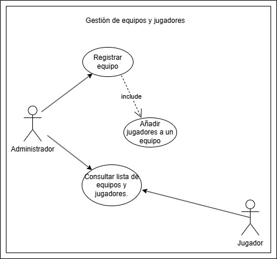
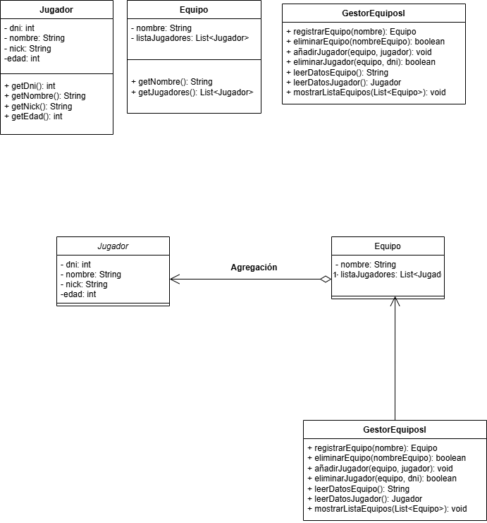

# Sistema de Gestión de Torneos de eSports

## Autor
Noelia Navas Garrido  
[GitHub Profile](https:https://github.com/NoeliaNavas)

## Descripción del Proyecto
Este proyecto implementa un sistema para gestionar torneos de eSports. Se incluyen diagramas UML y una propuesta de arquitectura modular con clases de entidad, control e interfaz.

### Diagrama de Casos de Uso

### Diagrama de Clases

## Justificación del diseño
He tilizaron clases de entidad para modelar objetos del dominio (Equipo, Jugador),y una interfaz (GestorEquiposI) para el funcionamiento de la aplicación.

## Conclusiones
Me ha costado un poco ver las clases desde el caso de usos, finalmente he concluido que estas tres eran las corestas para el caso de uso "Gestión de equipos y jugadores".
Por otro lado tengo bastante claro el el diagrama de uso, los incluse y los extends.
